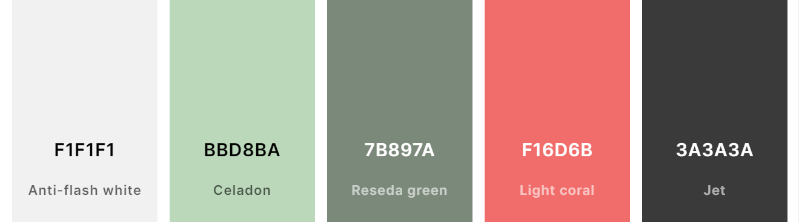

# To Be Ahead Blog - Introduction

Portfolio Project 4 for Code Institute Full-stack development program.
This project is a Full Stack website built using the Django framework. To Be Ahead Blog is a blog where users can look or search for prepping tips and ideas. Visitors can see some of what the blog contins. When the user is logged in they can also 
like/unlike a post and comment on a post. They can also flag if they whant their content to be shown on the front page for visitors to see their blog. The blog lets the user post a image with text and a title.

[Live Project Here](https://to-be-ahead-blog.herokuapp.com/)

README Table Content

- [To Be Ahead - Introduction](#to-be-ahead-blog---introduction)
- [User Experience - UX](#user-experience---ux)

- [Design](#design)

- [Features](#features)

- [Messages and Interaction With Users](#messages-and-interaction-with-users)

- [Admin Panel/Superuser](#admin-panelsuperuser)
- [Technologies Used](#technologies-used)
  - [Languages Used](#languages-used)
    - [Django Packages](#django-packages)
  - [Frameworks - Libraries - Programs Used](#frameworks---libraries---programs-used)
  - [Testing](#testing)
- [Creating the Django app](#creating-the-django-app)
- [Deployment of This Project](#deployment-of-this-project)
- [Final Deployment](#final-deployment)
- [Forking This Project](#forking-this-project)
- [Cloning This Project](#cloning-this-project)
- [Credits](#credits)
  - [Content](#content)
  - [Information Sources / Resources](#information-sources--resources)
- [Special Thanks](#special-thanks)

## User Experience - UX

## Design

 

## Features

## Messages and Interaction With Users

## Admin Panel/Superuser

* On the Admin Panel, as an admin/superuser I have full access to CRUD functionality so I can view, create, edit and
delete the following ones:
1. Posts
2. Comments
3. Profiles
4. Accept public
   
*As admin/superuser I can also approve comments, approve posts and change the status and give other permissions to the users. 

## Technologies Used

### Languages Used

* [HTML 5](https://en.wikipedia.org/wiki/HTML/)
* [CSS 3](https://en.wikipedia.org/wiki/CSS)
* [JavaScript](https://www.javascript.com/)
* [Django](https://www.python.org/)
* [Python](https://www.djangoproject.com/)

#### Django Packages

* [Gunicorn](https://gunicorn.org/) 
   As the server for Heroku
* [Cloudinary](https://cloudinary.com/) 
   Was used to host the static files and media
* [Dj_database_url](https://pypi.org/project/dj-database-url/) 
   To parse the database URL from the environment variables in Heroku
* [Psycopg2](https://pypi.org/project/psycopg2/) 
   As an adaptor for Python and PostgreSQL databases
* [Summernote](https://summernote.org/) 
   As a text editor
* [Allauth](https://django-allauth.readthedocs.io/en/latest/installation.html) 
   For authentication, registration, account
   management
* [Crispy Forms](https://django-crispy-forms.readthedocs.io/en/latest/) 
   To style the forms

### Frameworks - Libraries - Programs Used

* [Git](https://git-scm.com/) 
   Git was used for version control by utilizing the Gitpod terminal to commit to Git and push to GitHub
* [Bootstrap](https://getbootstrap.com/) 
   Was used to style the website, add responsiveness and interactivity
* [GitHub](https://github.com/) 
   GitHub is used to store the project's code after being pushed from Git
* [Heroku](https://id.heroku.com) 
   Heroku was used to deploy the live project
* [ElephantSQL](https://customer.elephantsql.com/login/) 
   Database used through heroku.
* [CodeAnywhere](https://apps.codeanywhere.com/) 
   VSCode was used to create and edit the website
* [PEP8](http://pep8online.com/) 
   PEP8 was used to validate all the Python code
* [W3C - HTML](https://validator.w3.org/) 
   W3C- HTML was used to validate all the HTML code
* [W3C - CSS](https://jigsaw.w3.org/css-validator/) 
   W3C - CSS was used to validate the CSS code
* [Fontawesome](https://fontawesome.com/) 
   To add icons to the website
* [Google Chrome Dev Tools](https://developer.chrome.com/docs/devtools/) 
   To check App responsiveness and debugging
* [Google Fonts](https://fonts.google.com/) **Not used now.** 
   To add the 2 fonts that were used throughout the project
* [Balsamiq](https://balsamiq.com/) 
   To build the wireframes overlay for the project
* [PIXLR](https://pixlr.com) 
   To convert the images to webp format
* [CANVA](https://www.canva.com/) **Not used now.** 
   To build the logos for the project
* [Coolors](https://coolors.co/) 
   To build the colour palette of the project
* [Emailjs](https://www.emailjs.com/) **Not used now.**  
   To send emails from the contact form

### Testing

Testing results [here](TESTING.md)

## Creating the Django app

1. Go to the Code Institute Gitpod Full Template [Template](https://github.com/Code-Institute-Org/gitpod-full-template)
2. Click on Use This Template
3. Once the template is available in your repository click on Gitpod
4. When the image for the template and the Gitpod are ready open a new terminal to start a new Django App
5. Install Django and gunicorn: `pip3 install django gunicorn`
6. Install supporting database libraries dj_database_url and psycopg2 library: `pip3 install dj_database_url psycopg2`
7. Create file for requirements: in the terminal window type `pip freeze --local > requirements.txt`
8. Create project: in the terminal window type django-admin startproject your_project_name
9. Create app: in the terminal window type python3 manage.py startapp your_app_name
10. Add app to the list of installed apps in settings.py file: you_app_name
11. Migrate changes: in the terminal window type python3 manage.py migrate
12. Run the server to test if the app is installed, in the terminal window type python3 manage.py runserver
13. If the app has been installed correctly the window will display The install worked successfully! Congratulations!

## Deployment of This Project

* This site was deployed by completing the following steps:

1. Log in to [Heroku](https://id.heroku.com) or create an account
2. On the main page click the button labelled New in the top right corner and from the drop-down menu select Create New
App
3. You must enter a unique app name
4. Next select your region
5. Click on the Create App button
6. Click in resources and select Heroku Postgres database
7. Click Reveal Config Vars and add a new record with SECRET_KEY
8. Click Reveal Config Vars and add a new record with the `CLOUDINARY_URL`
9. Click Reveal Config Vars and add a new record with the `DISABLE_COLLECTSTATIC = 1`
10. The next page is the project’s Deploy Tab. Click on the Settings Tab and scroll down to Config Vars
11. Next, scroll down to the Buildpack section click Add Buildpack select python and click Save Changes
12. Scroll to the top of the page and choose the Deploy tab
13. Select Github as the deployment method
14. Confirm you want to connect to GitHub
15. Search for the repository name and click the connect button
16. Scroll to the bottom of the deploy page and select the preferred deployment type
17. Click either Enable Automatic Deploys for automatic deployment when you push updates to Github

## Final Deployment 

1. Create a runtime.txt `python-3.8.13`
2. Create a Procfile `web: gunicorn your_project_name.wsgi`
3. When development is complete change the debug setting to: `DEBUG = False` in settings.py
4. In this project the summernote editor was used so for this to work in Heroku add: `X_FRAME_OPTIONS = SAMEORIGIN `to
   settings.py.
5. In Heroku settings, delete the config vars for `DISABLE_COLLECTSTATIC = 1`

## Forking This Project

* Fork this project by following the steps:

1. Open [GitHub](https://github.com/groundbuilder/to-be-ahead-blog)
2. Find the 'Fork' button at the top right of the page
3. Once you click the button the fork will be in your repository

## Cloning This Project

* Clone this project by following the steps:

1. Open [GitHub](https://github.com/groundbuilder/to-be-ahead-blog)
2. You will be provided with three options to choose from, HTTPS, SSH or GitHub CLI, click the clipboard icon in order
to copy the URL
3. Once you click the button the fork will be in your repository
4. Open a new terminal
5. Change the current working directory to the location that you want the cloned directory
6. Type 'git clone' and paste the URL copied in step 3
7. Press 'Enter' and the project is cloned

## Credits

### Content

* Ideas for content came from the book "Alltid Före"

### Information Sources / Resources

* [W3Schools - Python](https://www.w3schools.com/python/)
* [Stack Overflow](https://stackoverflow.com/)
* [Django](https://docs.djangoproject.com/en/4.2/)
* [Dev](https://www.devhandbook.com/django/user-profile/)

## Special Thanks

* Special thanks to my mentor Gareth.

