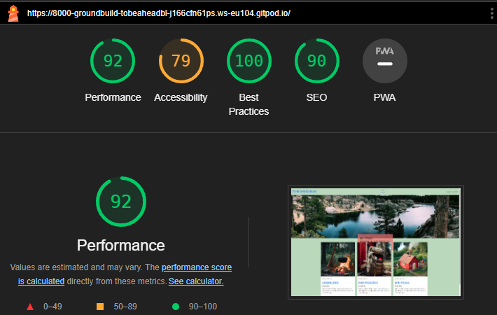
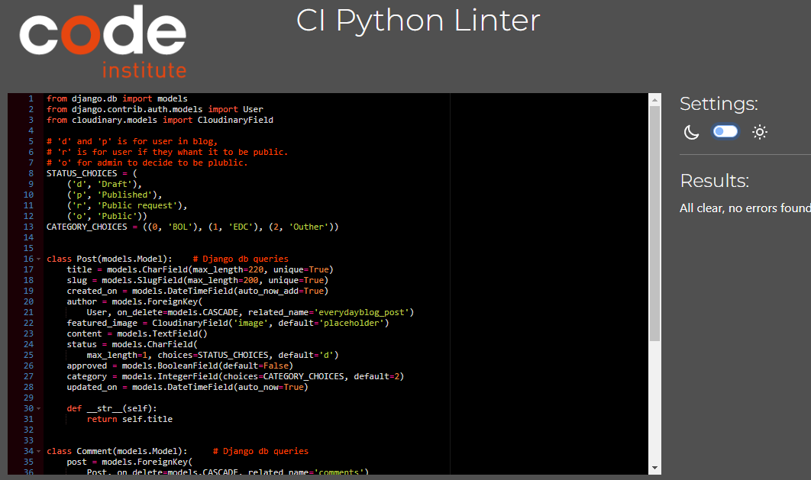

# Testing
Back to the [README](README.md)

* Testing has taken place continuously throughout the development of the project. Each view was tested regularly. 
  When the outcome was not as expected, debugging took place at that point.

## W3C - CSS Validation

 

## W3C - HTML Validation

It's not a fully html-page.

## Lighthouse

 

## PEP8 CI Python Linter - Validator
I tested my Python code and there are no errors. There were E501, cause it's comments on the code in the same line. https://pep8ci.herokuapp.com/

 

 